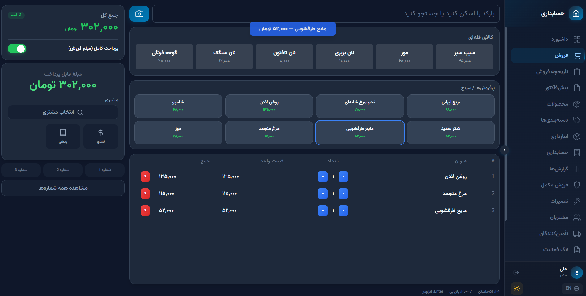
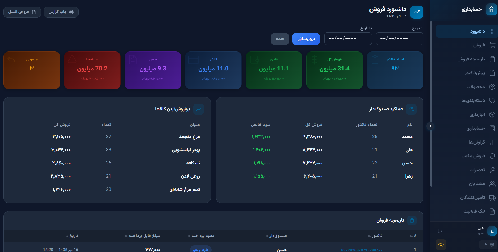
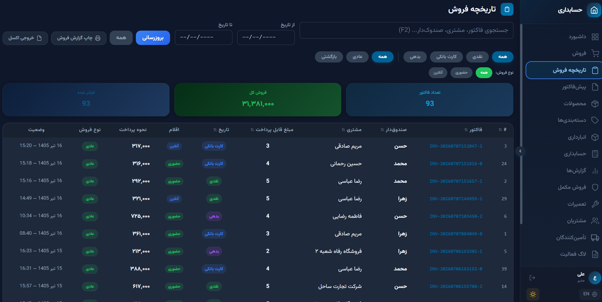
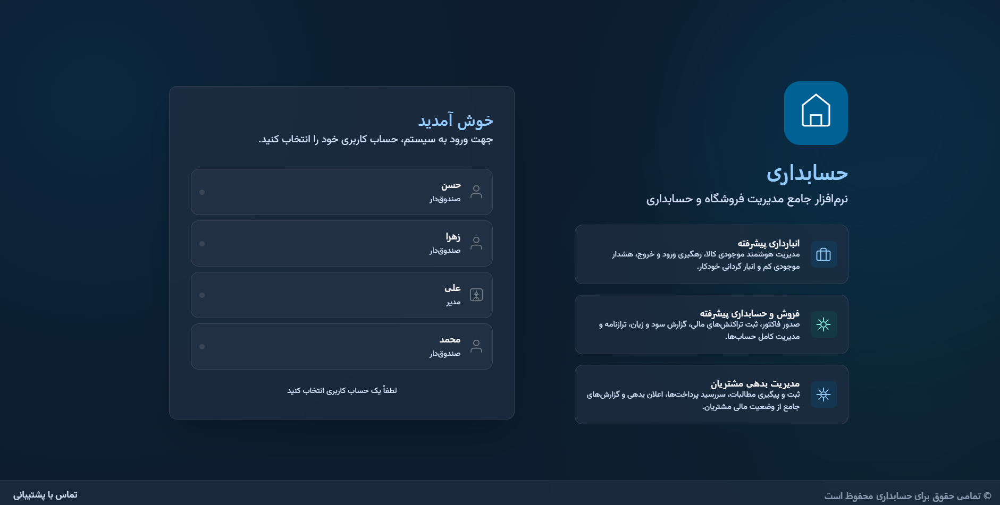
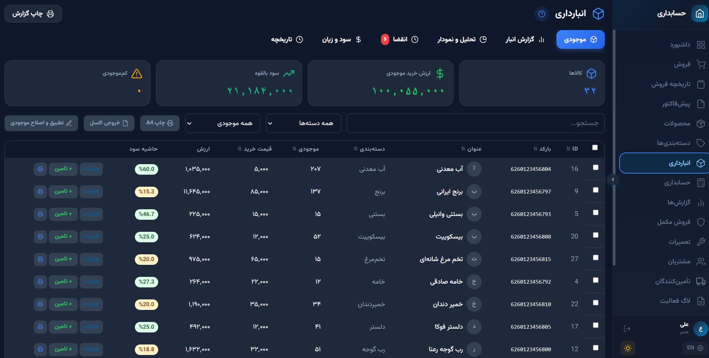
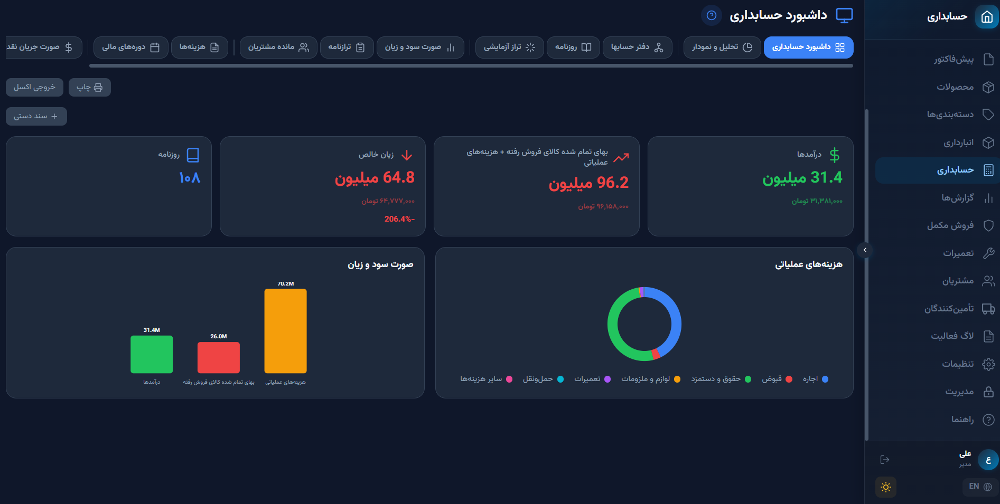

# حسابداری دانیال — HesabDari Danial

**نرم‌افزار جامع حسابداری، انبارداری و فروش برای کسب‌وکارهای مدرن**

**Smart Accounting, Professional Sales**

> **فارسی | [English](README-en.md)**

[](https://github.com/danialchoopan/DukanElectronJS)
[](#)
[](https://electronjs.org)
[](https://reactjs.org)

---

## اسکرین‌شات‌ها

| صفحه فروش | داشبورد | تاریخچه فروش |
|-----------|---------|--------------|
|  |  |  |

| ورود | انبار | حسابداری |
|------|-------|----------|
|  |  |  |

---

## دسترسی سریع

| [](SETUP.md) | [](TECHNICAL.md) | [](IMPLEMENTATION_PLAN.md) |
|---|---|---|

---

## چرا حسابداری دانیال؟

| ویژگی | توضیح |
|--------|--------|
| **یکپارچگی کامل** | حسابداری دوطرفه، مدیریت انبار، فاکتور و مشتری — همه در یکجا |
| **همگام‌سازی خودکار** | هر تراکنش فروش، خرید یا پرداخت خودکار در دفتر کل ثبت می‌شود |
| **امنیت بالا** | رمزنگاری AES-256، امضای دیجیتال، پشتیبان‌گیری خودکار |
| **طراحی مدرن** | رابط کاربری زیبا با پشتیبانی از حالت تاریک و روشن |
| **تقویم شمسی** | تمام تاریخ‌ها با تقویم شمسی (Jalali) نمایش داده می‌شوند |
| **انواع فروش** | فروش حضوری (پیشخوان) و فروش آنلاین با فیلتر و گزارش |
| **تاریخچه قیمت** | ثبت و پیگیری تغییرات قیمت خرید و فروش |
| **سازگاری نسخه‌ها** | مهاجرت خودکار داده‌ها بین نسخه‌های مختلف |
| **پشتیبانی چندزبانه** | فارسی و انگلیسی با پشتیبانی RTL کامل |

---

## ویژگی‌های کامل

### حسابداری (Accounting)
- دفتر حسابها با ساختار درختی (Chart of Accounts)
- ثبت اسناد حسابداری دوطرفه (Journal Entries)
- تراز آزمایشی (Trial Balance)
- صورت سود و زیان (Income Statement)
- ترازنامه (Balance Sheet)
- گردش وجوه نقد (Cash Flow Statement)
- گزارش سنی مطالبات مشتریان (AR Aging)
- مدیریت دوره‌های مالی (Fiscal Periods)
- همگام‌سازی خودکار فروش و خرید با دفتر کل
- تاریخچه تغییرات قیمت خرید و فروش
- هزینه‌ها با ثبت خودکار حسابداری
- ماشین حساب حرفه‌ای با تاریخچه و تبدیل ارز (Ctrl+M)

### انبارداری (Inventory)
- مدیریت محصولات با بارکد و QR
- اسکنر دوربین برای خواندن بارکد
- چاپ لیبل بارکد و QR
- گزارش موجودی و ارزش ریالی انبار
- کالاهای کندفروش
- تنظیم موجودی با ثبت خودکار (Inventory Adjustment)
- کالاهای تاریخ انقضا با هشدار خودکار
- چاپ A4 و خروجی اکسل
- تاریخچه تغییرات (Audit Log)

### فروش (Sales)
- صندوق فروش (POS) با اسکنر بارکد
- فاکتور الکترونیکی و چاپی
- انواع فروش: حضوری (پیشخوان) و آنلاین
- فروش نقدی، کارتی و اعتباری
- فروش با تاریخ گذشته (Backdated Sales)
- مرجوعی کالا با تفکیک ضرر/بازگشت
- فروش با موجودی صفر (غیرفعال شدن از صفحه POS)
- تاریخچه فروش با جستجو و فیلتر

### مشتریان و تأمین‌کنندگان
- مدیریت مشتریان با حساب دفتری (حقیقی/حقوقی)
- مدیریت تأمین‌کنندگان با حساب دفتری
- پیگیری بدهی و طلب
- پرداخت و دریافت با ثبت خودکار حسابداری
- مدیریت اعتبار مشتریان و مسدودی
- گزارش مشتریان برتر و الگوی خرید
- تحلیل سودآوری به تفکیک دسته‌بندی

### فروش پیشرفته
- قوانین فروش مکمل (اجباری / اختیاری / پیشنهادی)
- فروش اقساطی با برنامه پرداخت و پیگیری
- پیش‌فاکتور با تبدیل یک‌کلیک به فاکتور
- سرویس و گارانتی با گردش کار تیکت
- گزارش‌های پیشرفته فروش (۶ گزارش):
  - پرفروش‌ها
  - فروش ساعتی
  - مقایسه دوره‌ها
  - مشتریان برتر
  - سود دسته‌ها
  - الگوی خرید

### امنیت و پشتیبانی
- رمزنگاری AES-256
- امضای دیجیتال فایل‌ها
- پشتیبان‌گیری خودکار با قابلیت حذف
- پشتیبان‌گیری به USB با تشخیص خودکار
- بازیابی با اعتبارسنجی نسخه
- نقاط بازیابی با تأیید یکپارچگی (SHA-256)
- مهاجرت خودکار دیتابیس هنگام ارتقا نسخه
- لاگ فعالیت جامع با قابلیت جستجو و فیلتر
- کنترل دسترسی بر اساس نقش (RBAC — ۳۵ مجوز)

### سفارشی‌سازی و رابط کاربری
- سفارشی‌سازی منوی ناوبری (ترتیب، نمایش/مخفی کردن، بازنشانی)
- تم تاریک و روشن با ۶ رنگ اصلی
- اندازه متن قابل تنظیم (۵ سطح + دستی)
- کنتراست بالا برای دسترسی‌پذیری
- فونت وزیرمتن فارسی
- اسکنر دوربین برای بارکد و QR
- ماشین حساب شناور (Ctrl+M) و تمام‌صفحه

### صادرات و واردات هوشمند
- انتخاب بخش‌های دلخواه برای صادرات/واردات
- تشخیص خودکار وابستگی داده‌ها
- پیش‌نمایش قبل از واردات
- اعتبارسنجی و بررسی یکپارچگی
- خروجی SQLite (.db) / JSON (.json)

### مستندات و گزارش‌ها
- صورت سود و زیان با مقایسه دوره
- ترازنامه و گردش وجوه نقد
- گزارش سنی مطالبات مشتریان
- چاپ فاکتور، لیبل بارکد و QR
- خروجی اکسل از تمام گزارش‌ها

---

## مناسب برای چه کسب‌وکارهایی؟

| نوع کسب‌وکار | قابلیت‌های کلیدی |
|-------------|-----------------|
| فروشگاه اینترنتی | مدیریت سفارشات آنلاین، ارسال، مالیات الکترونیکی |
| سوپرمارکت | بارکد خوان، مدیریت موجودی، صندوق فروش |
| لباس‌فروشی | مدیریت سایز و رنگ، فصلی‌بودن، حسابداری دقیق |
| لوازم الکترونیک | گارانتی، سریال نامبر، قیمت‌گذاری پویا |
| کتاب‌فروشی | ناشران، چاپ‌ها، فروش آنلاین و حضوری |
| آرایشی و بهداشتی | تاریخ انقضا، لاین‌های مختلف محصولات |
| مواد غذایی | تاریخ انقضا، مدیریت ضایعات، وزنی/عددی |
| فروشگاه صنعتی | ابزارآلات، قطعات، پروژه‌محور |
| خدمات | صورتحساب خدمات، پروژه‌ها، ساعات کاری |
| عمده‌فروشی | قیمت‌گذاری عمده، مشتریان ویژه، اعتباری |
| رستوران و کافی‌شاپ | منو، سفارشات، مواد اولیه |
| طلا و جواهر | قیمت لحظه‌ای طلا، اجرت، مالیات ویژه |

---

## تکنولوژی‌ها

| لایه | تکنولوژی |
|------|----------|
| **فرانت‌اند** | React 18 + TypeScript 5 + Tailwind CSS |
| **بک‌اند** | Electron 33 + Node.js |
| **پایگاه داده** | SQLite (better-sqlite3) |
| **وضعیت** | Zustand 5 |
| **بیلد** | Vite 6 |
| **تقویم** | jalaali-js (Shamsi/Jalali) |
| **فونت** | Vazirmatn (local woff2) |

---

## نصب سریع

```bash
git clone https://github.com/danialchoopan/DukanElectronJS.git
cd DukanElectronJS
npm install
npm run dev
```

> **راهنمای کامل نصب:** [SETUP.md](SETUP.md) | [SETUP-en.md](SETUP-en.md)

---

## مستندات

| فایل | زبان | توضیح |
|------|------|-------|
| **[README.md](README.md)** | فارسی | نمای کلی پروژه و ویژگی‌ها |
| **[README-en.md](README-en.md)** | English | Project overview & features |
| **[SETUP.md](SETUP.md)** | فارسی | راهنمای نصب و راه‌اندازی |
| **[SETUP-en.md](SETUP-en.md)** | English | Installation guide |
| **[TECHNICAL.md](TECHNICAL.md)** | فارسی | مستندات فنی و معماری |
| **[TECHNICAL-en.md](TECHNICAL-en.md)** | English | Technical documentation |
| **[IMPLEMENTATION_PLAN.md](IMPLEMENTATION_PLAN.md)** | English | Feature implementation plan |
| [docs/index.html](docs/index.html) | فارسی | مرجع فنی کامل |
| [docs/developer-fa.html](docs/developer-fa.html) | فارسی | راهنمای توسعه‌دهندگان |
| [docs/developer-en.html](docs/developer-en.html) | English | Developer guide |
| [docs/doc-features.html](docs/doc-features.html) | English | Features reference |
| [docs/doc-schema.html](docs/doc-schema.html) | English | Database schema |
| [docs/doc-api.html](docs/doc-api.html) | English | API reference |
| [docs/doc-accounting.html](docs/doc-accounting.html) | English | Accounting system |
| [docs/doc-backup.html](docs/doc-backup.html) | English | Backup & migration |
| [docs/doc-ui.html](docs/doc-ui.html) | English | UI components |

---

## مجوز

MIT License — استفاده آزاد برای همه.

---

<div align="center">

**دانیال، همراه کسب‌وکارهای امروز**
**Danial, Partner for Today's Businesses**

</div>
